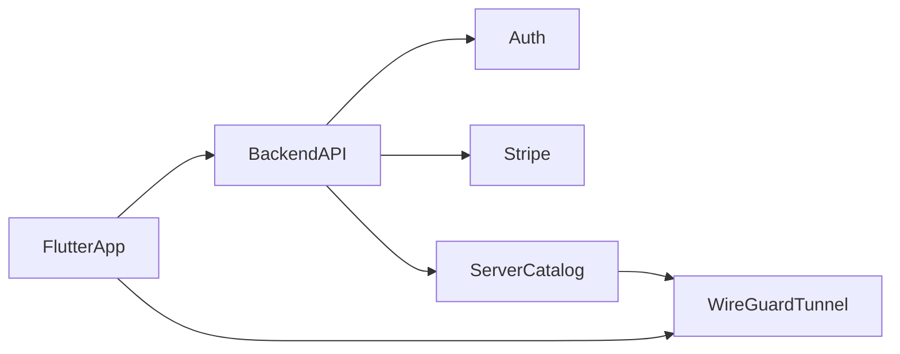

# Deferred: rich UX + accounts + billing

Parked for later. Do **not** block the live WireGuard / Discord MVP ([NEXT_ACTIONS.md](../NEXT_ACTIONS.md)) on this work.

## Context

Current VpnMania has a thin Express-inspired shell (Connect, Smart connect, latency picker, auto-reconnect, Windows kill-switch lite). Users still perceive a large gap vs ExpressVPN’s denser UI and commercial product surface. This plan collects that gap into one future track.

## Goals

- Make the client **feel** closer to a consumer VPN (more panels/options) while staying **Discord-first**
- Add **account**, **preferences**, and **billing** so the app can become a real product, not only a self-hosted tool

## Locked defaults (when this track starts)

- Keep **WireGuard** as the tunnel protocol
- Discord remains the hero use case (copy, Smart connect, optional Discord-only split tunnel)
- Billing via **Stripe** with subscription plans
- Auth: email + magic link or password (default candidate: Supabase Auth or Firebase — decide at kickoff)

## Workstreams

### A. Rich client UX (Express-like density)

1. **Home connection details** — server, public/VPN IP, duration, protocol badge, reconnect state
2. **Settings hub** — grouped sections (Connection, Privacy, Discord, Appearance, Account) instead of a short list
3. **Favorites / Recents** — pin servers; show on Recommended
4. **In-app latency / speed check** — button that refreshes probes and shows results
5. **Discord split tunnel (phase 2)** — route Discord (and related domains/apps) only; keep full-tunnel as default for censorship reliability
6. **Appearance** — theme (dark default), compact mode
7. Explicitly still skip unless demanded later: world map, Lightway/OpenVPN, ad blocker, obfuscation clone, in-app live chat

### B. Account and preferences

1. Sign up / sign in / sign out
2. Device list (optional: max N devices)
3. Preference sync: selected server, auto-connect, kill switch, favorites (cloud profile)
4. Privacy copy + export/delete account hooks

### C. Billing

1. Plans (e.g. monthly / yearly) aimed at Discord-access VPN
2. Stripe Checkout + Customer Portal
3. Entitlement gate: free/self-hosted mode vs subscribed multi-server catalog
4. Graceful offline: last-known entitlement cache with expiry

## Suggested architecture (later)

- Flutter stays the client
- Small backend issues configs / entitlements (never ship other users’ private keys in the clear without per-user peers)
- Self-hosted `servers.local.json` remains for power users / no-account mode

## Sequencing when resumed

1. Settings hub + connection details UI (visible win, no billing)
2. Favorites / Recents + stronger Recommended
3. Auth + preference sync
4. Stripe billing + entitlement-gated server list
5. Discord split tunnel
6. Polish (compact mode, device limits)

## Success criteria

- App feels option-rich without abandoning Discord focus
- User can create account, subscribe, and get working Discord access from managed servers
- Self-hosted path still works without an account

## Out of scope for this deferred plan

- Replacing WireGuard with IPsec/Express Lightway
- Full ExpressVPN feature parity
- Shipping billing before a real multi-server fleet exists

## Todos (when this track starts)

- [ ] Settings hub + home connection details panel (server, IP, duration, protocol)
- [ ] Favorites/Recents and denser Recommended server UX
- [ ] Auth + synced account preferences
- [ ] Stripe plans, checkout, portal, entitlement gate
- [ ] Discord-only split tunnel as optional mode
